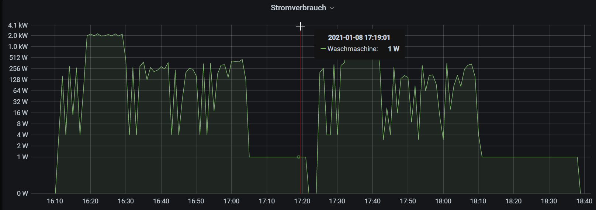

# waschmaschine

Predict the remaining washing time.

## Features

* Reads watt values from MySQL db and writes into pkl file
* Determine washing sessions (cleaning and clustering the records)
* Train a model
* Predict the remaining washing time during runtime
